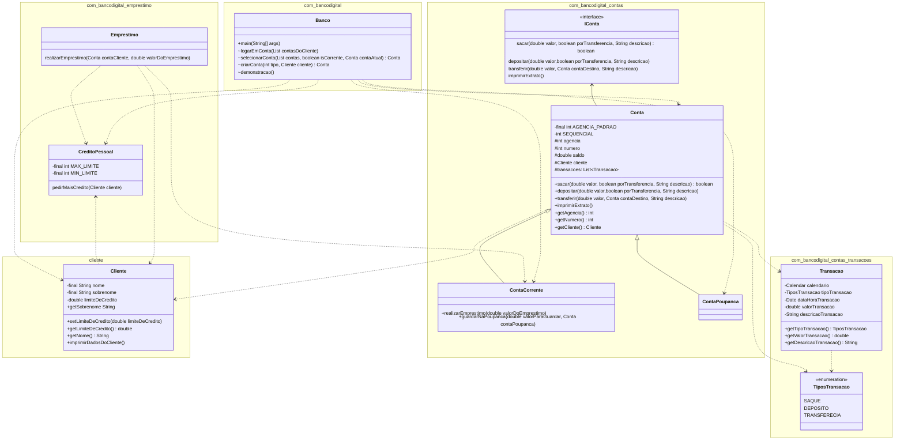

# BANCO DIGITAL DIO

## 📋Descrição
A ideia do desafio de projeto era simular um banco digital, replicando as funcionalidades do exemplo do desafio e adicionando novas funcionalidades. Acabei pegando o projeto como um desafio pessoal para tentar trazer um pouco mais de complexidade. trazendo funcionalidades básicas a mais, como limite de crédito, empréstimo, etc. Bem como trazer para o usuário uma navegabilidade fluida de jornada entre menus de forma minimamente intuitiva.

### 📝Funcionalidades:
- <b><i>Menu inicial</i></b>:
    - <b>Demonstração de Funcionalidades</b> -> A funcionalidade é um roteiro de demonstração que passa por diversas funcionalidades do Banco Digital, demonstrando como cada ação reflete, tanto no saldo das contas, como no extrato bancário e no limite do cliente.
    - <b>Logar em uma Conta</b> -> Esta funcionalidade lista as contas já cadastradas pelo cliente (tanto conta poupança como corrente), e permite que ele entre na conta e possa iniciar suas transações.
    - <b>Criar Conta Corrente</b> -> Ao selecionar esta funicionalidade, uma conta corrente é imediatamente criada para o usuário logado, e exibe a Agencia e Numero da nova conta. O usuário pode então selecionar a conta dentro da funcionalidade acima (Logar em uma Conta).
    - <b>Criar Conta Poupança</b> -> Exatamente identico ao item descrito acima, porém cria uma conta poupança para o usuário.
    - <b>Sair</b> -> Ao escolher esta opção, o a tela agradece ao usuário e encerra a aplicação. Durante a navegação em telas posteriores, o usuário sempre pode voltar ao menu inicial, portanto ele sempre tem a opção de voltar e sair da aplicação.
- <b><i>Menu Logado em Conta - Após selecionar conta na opção Logar em uma Conta:</i></b>
    - <b>Consultar Extrato</b> -> Funcionalidade permite que o usuário consulte o extrato da conta logada. O extrato demonstra todas as transações realizadas, com as seguintes informações:
        - <u>Nome do cliente</u>;
        - <u>Agencia e Numero da Conta</u>;
        - <u>Saldo atual da Conta</u>;
        - <u>Tipo da Transação:</u> Depósito,Saque ou Transferência;
        - <u>Valor da Transação</u>;
        - <u>Timestamp</u>: Data e Hora (com minuto e segundo) do momento exato da transação;
        - <u>Descrição da Transação</u>: Especifica a exata natureza da transação (como guardar na poupança, transferencia de outra conta, ou empréstimo).
    - <b>Depositar</b> -> A funcionalidade pergunta o usuário qual a quantia que ele deseja depositar, e em seguida adiciona este valor ao saldo da conta logada.
    - <b>Sacar</b> -> Assim como a funcionalidade acima, é perguntado ao usuário qual quantia ele deseja sacar, e realiza a retirada do valor do saldo da conta, porém se a conta não possuir saldo o suficiente para aquele saque, a transação não é concluída, e uma mensagem é apresentada ao usuário.
    - <b>Transferir</b> -> São listadas as contas correntes cadastradas pelo usuário para que ele possa transferir uma quantia da conta atual para uma outra conta. Caso não hajam outras contas correntes fora a logada para listar, uma mensagem será aprensetada ao usuário. <i>OBS: Contas Poupança não são listadas, e para guardar na poupança, o usuário deve utilizar a funcionalidade "Guardar na Poupança"</i>.
    - <b>Meus dados e limite</b> -> Essa funcionalidade apresenta na tela o nome e sobrenome do usuário, e seu limite de crédito atual. Todo usuário inicia com um limite de crédito de R$1.000,00 e pode ter um máximo de R$50.000,00.
    - <b>Pedir mais limite</b> -> Esta funcionalidade concede mais limite pro usuário automaticamente. O limite concedido a mais é um valor aleatório entre R$1.000,00 e R$50.000,00 (somado no limite que o usuário possui atualmente, limitando a R$50.000,00). Caso o usuário já possua o limite máximo, uma mensagem é apresentada.
    - <b>Realizar empréstimo</b> -> Esta funcionalidade pergunta para o usuário quanto de empréstimo ele quer, e credita este valor, desde que o usuário possua limite de crédito. O valor creditado consome o limite do usuário, que pode ser consultado na funcionalidade "Meus dados e limite". <i>OBS: Esta funcionalidade não aparece para conta poupança, apenas para conta corrente.</i>
    - <b>Guardar na Poupança</b> -> Esta funcionalidade lista as contas poupança cadastradas pelo usuário, permitindo que ele escolha uma e escolha o valor a guardar. Isso essencialmente transfere o valor da conta atual para conta poupança escolhida. <i>OBS: Esta funcionalidade não aparece se o usuário estiver logado em uma conta poupança, apenas em conta corrente.</i>
    - <b>Voltar</b> -> Volta para o menu inicial.

## 💻 Informações Técnicas

### Execução:
A execução da aplicação é feita através da classe "Banco", que possui o método "main". A classe está contida no pacote "com.bancodigital".

### Estrutura de Classes (UML):

## 📈Futuras Melhorias

Diversos pontos desse projeto podem ser melhorados com o tempo.

Exemplos:

- <b>Exceptions</b>: O projeto não utiliza de exceptions para validação de regra de negócio, e esta é uma boa prática que poderia ser modificada. Todas as validações são feitas condicionalmente.
- <b>Múltiplos usuários</b>: A estrutura de classes e validações estão preparadas para múltiplos usuários poderem transferir dinheiro entre contas. Um exemplo: Quando você está guardando um dinheiro na poupança, o processo verifica se a conta poupança pertence a mesma pessoa da conta que está transferindo, e caso não seja, ela não permite seguir. No processo atual, esse cenário nunca vai acontecer, pois a transferência só ocorre entre as contas do mesmo usuário. De qualquer forma daria para ser implementado algo com múltiplos usuários.
- <b>Refactoring</b>: Alguns trechos de código podem estar sendo repetidos, e com um refectoring mais completo, daria para melhorar e otimizar o código.

